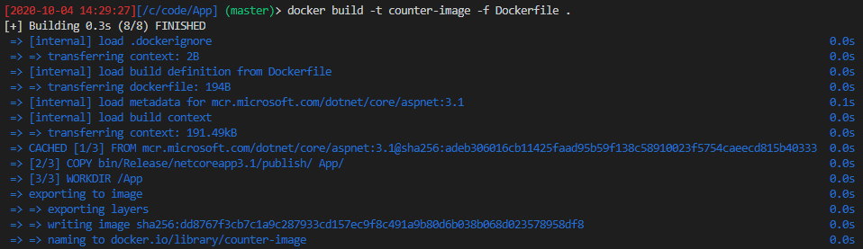

# How to containerize a .NET Core APP

This is just a repository I created by following instructions from [Microsoft docs online](https://docs.microsoft.com/en-us/dotnet/core/docker/build-container?tabs=linux). I followed along and took notes and tried out the commands in order avoid distractions. That's what resulted in this. You can follow along using the main docs and do not have to read this README.

 - Create and publish a .NET Core app
 - Create and configure a Dockerfile for .NET Core
 - Build a Docker image
 - Create and run a Docker container

 Remember, this is not for ASP.NET Core this is .NET Core. 

 ## Prerequisites:

  - [.NET Core 3.1 SDK](https://dotnet.microsoft.com/download)
  - [Docker Community Edition](https://www.docker.com/products/docker-desktop)
  - a temporary working folder for the Dockerfile and .NET core example. 

 ## Create the .NET Core App

 Go to a local directory and type:

 ```bash 
 dotnet new console -o App -n NetCore.Docker
 ```
Creates a new application folder - `App` and genreates a hello world app. 

Go into the directory and try 

```bash
dotnet run
Hello World!
```

The default template creates an app that prints to the terminal and then immediately terminates. 

Open `Program.cs` in your favourite editor and then paste the following code in it. 

```csharp
using System;
using System.Threading.Tasks;

namespace NetCore.Docker
{
    class Program
    {
        static async Task Main(string[] args)
        {
            var counter = 0;
            var max = args.Length != 0 ? Convert.ToInt32(args[0]) : -1;
            while (max == -1 || counter < max)
            {
                Console.WriteLine($"Counter: {++counter}");
                await Task.Delay(1000);
            }
        }
    }
}
```
Save and close and run `dotnet run` again. 
You'll notice that the app now prints a counter and keeps incrementing the counter until you forcefully stop the application using `Ctrl+C`. 

## Publish the app

Unlike regular dotnet, dotnet core requires you to [publish](https://docs.microsoft.com/en-us/dotnet/core/tools/dotnet-publish) your app. This will create a folder with the application and dependencies code, making it ready for deploying to a target host.

```bash
dotnet publish -c Release
```

The command published the app in Release mode to `.\App\bin\Release\netcoreapp3.1\publish`

## Create Dockerfile
This is the file that docker uses when executing the `docker build` command. This is a text file with no extension. 

Create a file named `Dockerfile` in the application directory, the one containing the `csproj` file. And add the following to it.

```shell
FROM mcr.microsoft.com/dotnet/core/aspnet:3.1
```

The `FROM` keyword requires a fully qualified Docker container image name. 

Microsoft Container Register (mcr) is a syndicate of Docker Hub which hosts publicly accessible containers. The `dotnet/core` segment is the container repository, where as the aspnet segment is the container name. The image is taged with 3.1, which is used for versioning (obviously). For example, the app created in the previous section used the .NET Core 3.1 SDK and the base image referred to in the Dockerfile is tagged with 3.1.

Now from your terminal run:

```bash
docker build -t counter-image -f Dockerfile .
```

Docker will start going through every line in the Dockerfile. The . in the docker build command tells Docker to use the current folder to find the Dockerfile. This command builds the image and creates a local repository named `counter-image` that points to that image. After the command finishes, run `docker images` to view the list of docker images installed. 


It does display all images in my pc, including the docker tutorial one. 

You might also have noticed that some of them share the same `IMAGE ID`. This is because one is based on the other. 

Add a few more commands to the *Dockerfile*. 

```bash
COPY bin/Release/netcoreapp3.1/publish/ App/
WORKDIR /App
ENTRYPOINT ["dotnet", "NetCore.Docker.dll"] 
```

Let us take a look at the lines in the snippet above.

COPY command, copies a source to the destination in the container. Here it copies the `publish` folder to the `App` folder in the container. 

The `WORKDIR` changes the current directory inside the container to `App`. This is the `cd` equivalent for docker to perform in the container. 

`ENTRYPOINT` tells Docker to configure the container to run as an executable. The command specified as arguments to the `ENTRYPOINT` will be executed. When this finishes execution, the container would automatically stop. 

Now run the build command again. 



Each command in the *Dockerfile* created a layer and created an __IMAGE ID__


## Create Container

```bash
docker create --name core-counter counter-image
```

In the above command __core-counter__ is the name of the container. __counter-image__ is the image that we created earlier. 

Now that I have created the container, I can view all of them from the local docker registry using:

```bash
docker ps -a
```


## Manage the container

We now have the container ready for us to use and manage. In fact, if you ran the commands I listed earlier, you already have it running. 

### Start Container

```bash
docker start core-counter
```


### Stop Container

```bash
docker stop core-counter
```


### Connect to a container

Most often you don't just want to start a container but also see what the container is doing, its output etc. 

Let us start the core-counter and then connect to it.


The `--sig-proxy=false` command line parameter ensures that `Ctrl+C` will not stop the process in the container. It is basically telling docker to stop sending signals to the process inside the container. 

### Delete a container

```bash
docker stop core-counter

docker ps -a

docker rm core-counter
```


## One command to create and run

Earlier we created a container then started it separately. There is another way to create and run a container, using one command alone. 

You could also do more! 

```bash
docker run -it --rm counter-image
```

Looks mysterious! `-it` is a cool way of telling docker that there is more to do. Docker runs and attaches itself to the container then deletes the container when an interrupt (`Ctrl+C`) signal is encountered!


## Change ENTRYPOINT

`docker run` command allows you to provide a custom __ENDPOINT__, one that's different from what is listed in the _Dockerfile_ but only for the instance of the container you are starting with this command.

```bash
docker run -it --rm --entrypoint "bash" counter-image
```


## Remove Image

`rmi` command allows deletion of images using **IMAGE ID** or the **REPOSITORY:TAG** format

```bash
docker rmi counter-image:latest
docker rmi mcr.microsoft.com/dotnet/core/aspnet:3.1
```


